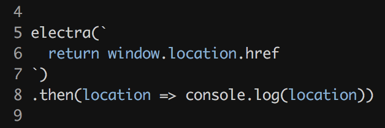

<div align="center">

# electra

#### The simplest API for running code inside electron!



</div>

* __Full access to the DOM and browser APIs__
* __Synchronous and asynchronous code execution with Promise support__
* __Electron comes bundled!__

## Usage

`electra` supports synchronous code, promises and callbacks:

```js
const electra = require('electra')

// synchronous

electra(`
  return window.location.href
`)
.then(location => {
  console.log(location)
})

electra(() => {
  return window.location.href
})
.then(location => {
  console.log(location)
})

// promise

electra(() => {
  return fetch('/')
    .then(res => res.status)
})
.then(status => {
  console.log(status)
})

electra(`
  return fetch('/')
    .then(res => res.status)
`)
.then(status => {
  console.log(status)
})

// callback

electra(cb => {
  cb(null, window.location.href)
})
.then(location => {
  console.log(location)
})
```

## Installation

```bash
$ npm install --save electra
```

## API

### p = electra(src)

## License

MIT
